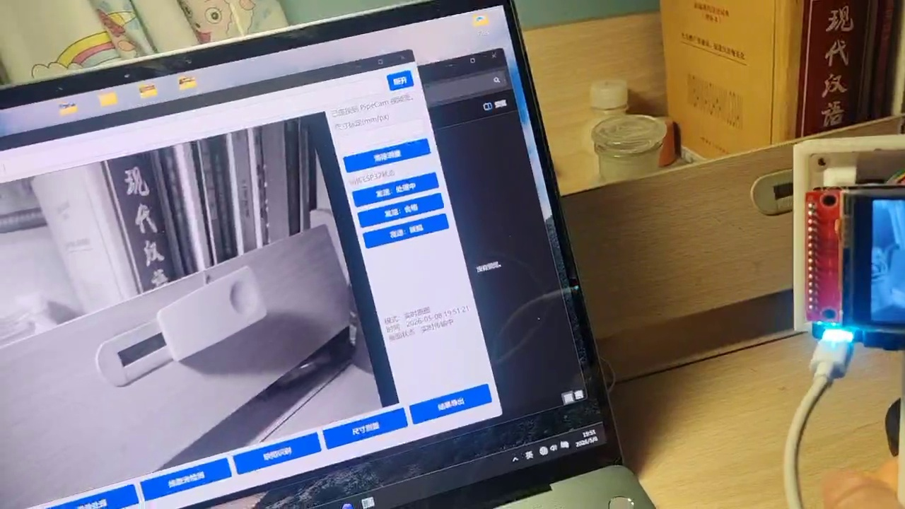

# PipeCam: ESP32-S3 Visual Inspection and OCR


> A compact ESP32-S3 camera pipeline for pipe / cylindrical-part visual inspection: capture UVC frames on-device, expose an MJPEG stream over a board-hosted Wi-Fi AP, run OCR on a Windows host, and return recognition state to the device UI.

This repository is a faithful, research-oriented curation of the local PipeCam project. It contains the ESP32-S3 firmware, Qt/C++ host source, Python/PaddleOCR adapter, local OCR model files, inspection samples, schematics, research documents, the two supplied UI screenshots, and a field demonstration video.

The repository documents what the current files implement. It does not turn a software demo into a production, safety, accuracy, or certification claim.

## Demonstration

The following poster is a frame from the supplied field video. The video shows the host UI receiving an ESP32 camera stream while the device is present in the test setup.



The full video is available in the repository: [`pipecam-field-demo.mp4`](docs/media/pipecam-field-demo.mp4). For a larger, styled presentation with an embedded player, open the [GitHub Pages showcase](https://satoru-1006.github.io/esp32-pipecam-ocr/).

The supplied recognition screenshots are preserved here:

- [`ui-result-779422134400035.png`](docs/media/ui-result-779422134400035.png)
- [`ui-result-179422134400035.png`](docs/media/ui-result-179422134400035.png)

## What is implemented

### Device side: ESP32-S3 firmware

`firmware/esp32-s3/main/main.c` implements the board-side service loop:

- USB UVC camera capture through Espressif `usb_stream`.
- Board-hosted Wi-Fi AP with an SSID derived from the SoftAP MAC address (`PipeCam-XXXX`).
- MJPEG stream on `http://192.168.4.1:8080/stream`.
- Status, result, and control endpoints on port `8081`.
- LCD status page, backlight control, laser / fill-light control, buzzer output, and physical-key polling.
- Device-side state transitions for idle, processing, pass, fail, and error feedback.

The source currently contains the default AP password `12345678`. This is a project default, not a secret. Change it before using the firmware in any environment where the AP is not isolated.

### Host side: Python adapter

`host/python/esp32_ocr_adapter.py` is a standalone PySide6/OpenCV host application. It discovers the configured stream endpoint, maintains an MJPEG frame thread, triggers OCR, posts result state back to the ESP32, stores captures, and writes CSV scan records.

`host/python/Py_Module.py` is the embedded Python OCR module used by the Qt application. It loads the local PaddleOCR models and evaluates multiple grayscale / contrast / threshold variants of a cropped number band before selecting a candidate.

### Host side: Qt/C++ application

`host/qt/mainwindow/` contains the Qt project and source files:

- Qt Network MJPEG reception and frame display.
- Embedded Python initialization and `Py_Module.py` invocation.
- OCR result display, copy / clear controls, status polling, and local SQLite record handling.
- Preserved historical camera and Modbus adapter sources (`cmvcamera.*`, `mycamera.*`, `myknd.*`) for provenance. They are not presented as the active ESP32 main path.

### Evidence and media

The repository also includes:

- Local PaddleOCR model archives and inference files under `host/qt/mainwindow/models/`.
- Captured frames, OCR debug regions, and sample image collections under `data/`.
- The original project research reports and board schematics under `docs/`.
- `artifacts/firmware/` with the locally produced ESP32 binary artifacts when available.
- `artifacts/windows/mainwindow.exe`, preserved as a build artifact; it is not a self-contained distribution without its matching runtime and model files.
- `release/pipecam-local-snapshot-2026-07.zip` is intentionally not committed to Git. It is uploaded as a release asset when the release is created.

## System architecture

```text
USB UVC camera
      │
      ▼
ESP32-S3 firmware ── Wi-Fi AP / MJPEG / JSON control ──► Qt or Python host
      │                                                   │
      ├─ LCD + keys + light + buzzer                      ├─ OpenCV frame decode
      └─ result state feedback ◄──── HTTP POST/GET ◄──────┤
                                                          ├─ PaddleOCR local models
                                                          └─ CSV / SQLite records
```

The vector version is available at [`docs/assets/pipeline.svg`](docs/assets/pipeline.svg) and on the [Pages showcase](https://satoru-1006.github.io/esp32-pipecam-ocr/).

## Quick start

### Firmware

Install ESP-IDF `5.2.x` or newer, then build from the firmware directory:

```powershell
cd firmware/esp32-s3
idf.py set-target esp32s3
idf.py build
idf.py -p COM8 flash monitor
```

The local project was configured for ESP-IDF `5.2.2`, target `esp32s3`, and the Espressif `usb_stream` component. See [`firmware/esp32-s3/UPSTREAM_README.md`](firmware/esp32-s3/UPSTREAM_README.md) for the original project notes and [`docs/REPRODUCIBILITY.md`](docs/REPRODUCIBILITY.md) for path and packaging caveats.

### Python host

The source-side adapter expects Python packages including PySide6, OpenCV, NumPy, and PaddleOCR/PaddlePaddle. From the repository root:

```powershell
python -m pip install PySide6 opencv-python numpy paddleocr paddlepaddle
python host/python/esp32_ocr_adapter.py
```

Connect the computer to the board AP, then use the UI to connect to the stream. The original helper batch files are retained under `host/python/`.

### Qt host

Open `host/qt/mainwindow/mainwindow.pro` in Qt Creator with a Qt 6 / MSVC 64-bit kit. The project source retains the original embedded-Python layout and expects a matching Python 3.10 runtime layout when built as the packaged application. A source-only clean build is therefore not claimed by this repository without completing that environment setup.

## Protocol summary

| Endpoint | Method | Purpose |
| --- | --- | --- |
| `:8080/stream` | `GET` | Multipart MJPEG stream |
| `:8081/status` | `GET` | Device state, keys, clients, capture counters |
| `:8081/control` | `GET` | Laser, realtime, capture, result, buzzer controls |
| `:8081/result` | `POST` | Host-to-device OCR state and text feedback |

See [`docs/PIPE_CAM_PROTOCOL.md`](docs/PIPE_CAM_PROTOCOL.md) for field names, examples, and the source locations that implement them.

## Reproducibility and evidence boundary

The screenshots and field video demonstrate an integrated test setup. They do not establish a statistical OCR benchmark, calibrated measurement accuracy, production readiness, or safety certification. The current repository is best understood as a working research prototype with evidence artifacts.

Known boundary conditions are recorded explicitly in [`docs/LIMITATIONS.md`](docs/LIMITATIONS.md). The file-by-file inclusion and exclusion decisions are in [`PROJECT_MANIFEST.md`](PROJECT_MANIFEST.md), and third-party material is listed in [`THIRD_PARTY_NOTICES.md`](THIRD_PARTY_NOTICES.md).

## Project map

```text
firmware/esp32-s3/       ESP-IDF project, main.c, managed components
host/python/              PySide6/OpenCV adapter and OCR module
host/qt/mainwindow/       Qt/C++ project, models, samples, debug ROIs
data/                     Captures, CSV/SQLite records, OCR datasets
docs/media/               Screenshots, video, poster frame
docs/reports/             Research reports and supporting documents
docs/schematics/          Board schematics
artifacts/                Locally built firmware and Windows executable
docs/index.html           GitHub Pages showcase
```

## License status

No new open-source license is asserted for the mixed local project because it contains user-authored code, generated artifacts, bundled model files, and third-party components with separate provenance. See [`LICENSE_STATUS.md`](LICENSE_STATUS.md) before redistributing or using it commercially.

